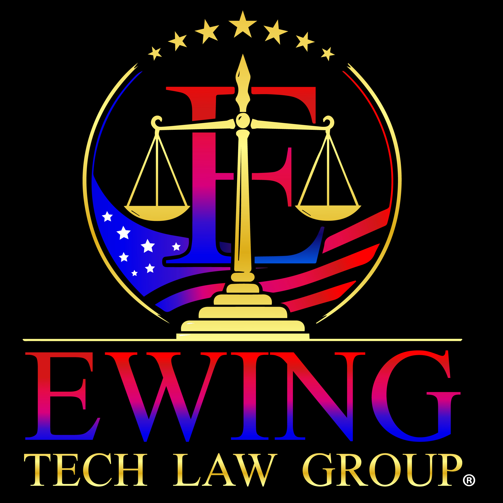

  
  &nbsp;&nbsp;&nbsp;&nbsp;

  

# 🤖 NONS Humanoid
## Next-generation Operative Neural System
**Invented by Mason Ewing, Thorbok Tech © 2026. All Rights Reserved.**

---

## 🌍 What is NONS Humanoid?

NONS Humanoid is the **world's first investigative humanoid android**, 
conceived and invented by **Mason Ewing** and developed by **Thorbok Tech**.

NONS stands for **Next-generation Operative Neural System** — a name 
exclusively created by Mason Ewing.

---

## 🎯 Mission
> *"We Do Not Replace Humans. We Elevate Justice."*

NONS Humanoids exist for one sacred purpose: **to bring truth and 
protect the innocent.** Operating exclusively in partnership with 
Ewing Tech Law Group (ETLG).

---

## 🕵️ NONS-001 — Detective Christopher Connor
The world's first NONS Humanoid detective.

---

## 🏛️ Partnership

<table>
<tr>
<td></td>
<td valign="middle" align="center"><strong>Thorbok Tech × Ewing Tech Law Group (ETLG)</strong></td>
<td></td>
</tr>
</table>
---

## 🔗 Links
- 🌐 https://www.thorboktech.io
- 🌐 https://www.masonewingcorp.com

---

## ⚖️ Legal
**Copyright 2026 Mason Ewing, Thorbok Tech. All Rights Reserved.**
**Patent Pending.**
